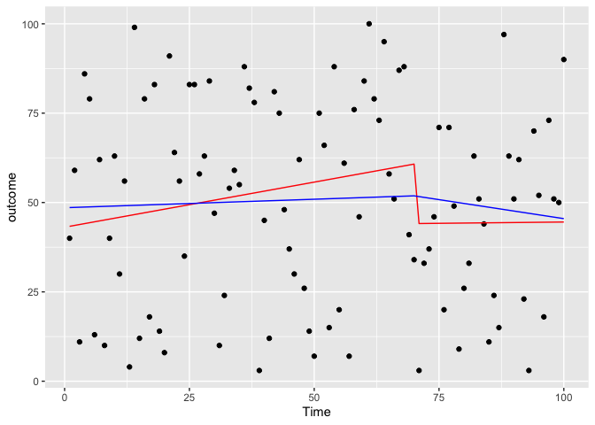
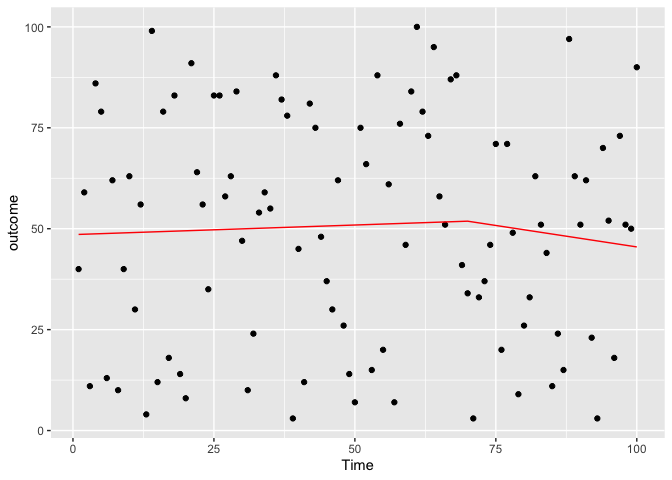
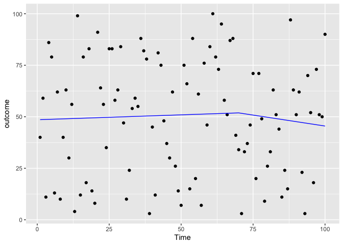
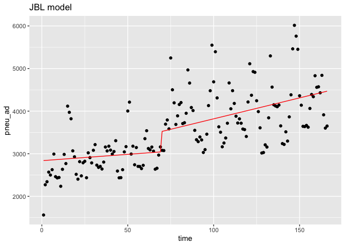
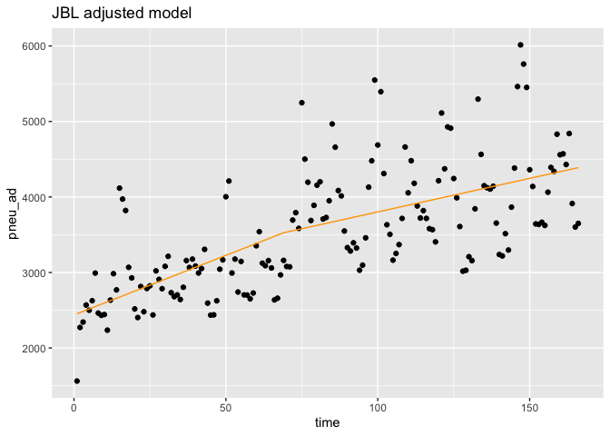
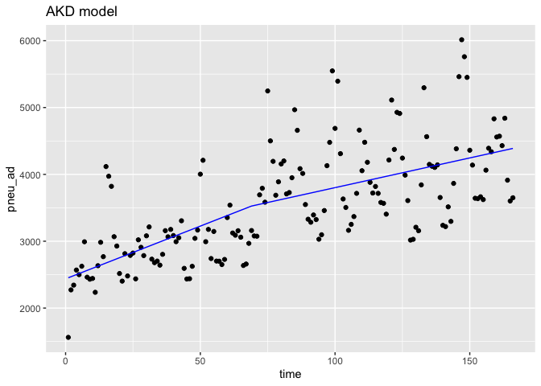

1. Background
-------------

The textbook for ITS is the JLB’s tutorial [《Interrupted time series
regression for the evaluation of public health interventions: a
tutorial》](https://pubmed.ncbi.nlm.nih.gov/27283160-interrupted-time-series-regression-for-the-evaluation-of-public-health-interventions-a-tutorial/).
When i dig deeper, i found the ultimate reference was AKD articles in
2002 [《Segmented regression analysis of interrupted time series studies
in medication use
research》](https://pubmed.ncbi.nlm.nih.gov/12174032-segmented-regression-analysis-of-interrupted-time-series-studies-in-medication-use-research/).
But the formulas used in these two papers have a slight difference.

2. The JLB’s **interaction model**:
-----------------------------------

$$
\\begin{aligned}
Y \\sim {\\sf  } \\beta\_{1}·Time + \\beta\_{2}·Intervention +\\beta\_{3}·Time ·Intervention
\\end{aligned}
$$

2.1 The dataset lookd like:
---------------------------


2.2 Interpretation of parameters
--------------------------------


3 The AKD’s **additional model**:
---------------------------------

$$
\\begin{aligned}
Y \\sim {\\sf  } \\beta\_{1}·Time + \\beta\_{2}·Intervention +\\beta\_{3}·NewTimeAfter  Intervention
\\end{aligned}
$$

3.1 The dataset looks like:
---------------------------


3.2 Interpretation of parameters
--------------------------------


4 The difference between two models
-----------------------------------

``` r
library('ggplot2')
```

### 4.1 Generate a dataset

``` r
set.seed(999)
testdf <- data.frame(outcome = ceiling(runif(100,1,100)),Time = 1:100, PCV = c(rep(0,70),rep(1,30)),NewTime = c(rep(0,70),1:30))
testdf
```

    ##     outcome Time PCV NewTime
    ## 1        40    1   0       0
    ## 2        59    2   0       0
    ## 3        11    3   0       0
    ## 4        86    4   0       0
    ## 5        79    5   0       0
    ## 6        13    6   0       0
    ## 7        62    7   0       0
    ## 8        10    8   0       0
    ## 9        40    9   0       0
    ## 10       63   10   0       0
    ## 11       30   11   0       0
    ## 12       56   12   0       0
    ## 13        4   13   0       0
    ## 14       99   14   0       0
    ## 15       12   15   0       0
    ## 16       79   16   0       0
    ## 17       18   17   0       0
    ## 18       83   18   0       0
    ## 19       14   19   0       0
    ## 20        8   20   0       0
    ## 21       91   21   0       0
    ## 22       64   22   0       0
    ## 23       56   23   0       0
    ## 24       35   24   0       0
    ## 25       83   25   0       0
    ## 26       83   26   0       0
    ## 27       58   27   0       0
    ## 28       63   28   0       0
    ## 29       84   29   0       0
    ## 30       47   30   0       0
    ## 31       10   31   0       0
    ## 32       24   32   0       0
    ## 33       54   33   0       0
    ## 34       59   34   0       0
    ## 35       55   35   0       0
    ## 36       88   36   0       0
    ## 37       82   37   0       0
    ## 38       78   38   0       0
    ## 39        3   39   0       0
    ## 40       45   40   0       0
    ## 41       12   41   0       0
    ## 42       81   42   0       0
    ## 43       75   43   0       0
    ## 44       48   44   0       0
    ## 45       37   45   0       0
    ## 46       30   46   0       0
    ## 47       62   47   0       0
    ## 48       26   48   0       0
    ## 49       14   49   0       0
    ## 50        7   50   0       0
    ## 51       75   51   0       0
    ## 52       66   52   0       0
    ## 53       15   53   0       0
    ## 54       88   54   0       0
    ## 55       20   55   0       0
    ## 56       61   56   0       0
    ## 57        7   57   0       0
    ## 58       76   58   0       0
    ## 59       46   59   0       0
    ## 60       84   60   0       0
    ## 61      100   61   0       0
    ## 62       79   62   0       0
    ## 63       73   63   0       0
    ## 64       95   64   0       0
    ## 65       58   65   0       0
    ## 66       51   66   0       0
    ## 67       87   67   0       0
    ## 68       88   68   0       0
    ## 69       41   69   0       0
    ## 70       34   70   0       0
    ## 71        3   71   1       1
    ## 72       33   72   1       2
    ## 73       37   73   1       3
    ## 74       46   74   1       4
    ## 75       71   75   1       5
    ## 76       20   76   1       6
    ## 77       71   77   1       7
    ## 78       49   78   1       8
    ## 79        9   79   1       9
    ## 80       26   80   1      10
    ## 81       33   81   1      11
    ## 82       63   82   1      12
    ## 83       51   83   1      13
    ## 84       44   84   1      14
    ## 85       11   85   1      15
    ## 86       24   86   1      16
    ## 87       15   87   1      17
    ## 88       97   88   1      18
    ## 89       63   89   1      19
    ## 90       51   90   1      20
    ## 91       62   91   1      21
    ## 92       23   92   1      22
    ## 93        3   93   1      23
    ## 94       70   94   1      24
    ## 95       52   95   1      25
    ## 96       18   96   1      26
    ## 97       73   97   1      27
    ## 98       51   98   1      28
    ## 99       50   99   1      29
    ## 100      90  100   1      30

### 4.2 Model with interaction term

``` r
test1 <- glm(data=testdf,outcome~Time+PCV+Time*PCV)
coef(test1)
```

    ## (Intercept)        Time         PCV    Time:PCV 
    ##  44.3055901   0.2264019 -69.8521232   0.5827194

### 4.3 Model with additional term

``` r
test2 <- glm(data=testdf,outcome~Time+PCV+NewTime)
coef(test2)
```

    ## (Intercept)        Time         PCV     NewTime 
    ##  44.3055901   0.2264019 -29.0617683   0.5827194

### **Two of the paper both pointed out that the parameter of PCV is the slope changes after intervention. But the numbers are quite different.**

### **I think one of them is wrong, or we should present it after some adjustments like Dr.Qiu did in the Wechat group. It may be the reason why we always see a level change even we just used the slope-only model in JLB’s method.**

### **I am not going to say JLB’s method is wrong. I consider that it is not appropriate for the slope-only model, and we should be cautious when interpreting the level’s parameter.**

### **I am still thinking from the formula perspective. Maybe my point of view is wrong. Pls save me.**

5.Slope-only model in two method
--------------------------------

``` r
test3 <- glm(data=testdf,outcome~Time+Time:PCV)
coef(test3)
```

    ## (Intercept)        Time    Time:PCV 
    ##  43.0861172   0.2523481  -0.2378050

``` r
test4 <- glm(data=testdf,outcome~Time+NewTime)
coef(test4)
```

    ## (Intercept)        Time     NewTime 
    ##  48.5384253   0.0475497  -0.2601473

``` r
predicted_df <- data.frame(outcome_pred = predict(test3,testdf),Time=testdf$Time)
predicted_df2 <- data.frame(outcome_pred = predict(test4,testdf),Time=testdf$Time,NewTime=testdf$NewTime)


ggplot(data = testdf, aes(x = Time, y = outcome)) + 
    geom_point(color='black') +
    geom_line(color='red',data = predicted_df, aes(x=Time, y=outcome_pred))+
    geom_line(color='blue',data = predicted_df2,aes(x=Time,y=outcome_pred))
```



### 5.1. Fixed the previous problem by changing the time

``` r
test5 <- glm(data=testdf,outcome~Time+NewTime:PCV)
coef(test5)
```

    ## (Intercept)        Time NewTime:PCV 
    ##  48.5384253   0.0475497  -0.2601473

``` r
predicted_df3 <- data.frame(outcome_pred = predict(test5,testdf),Time=testdf$Time,NewTime = testdf$NewTime)

ggplot(data = testdf, aes(x = Time, y = outcome)) + 
    geom_point(color='black') +
    geom_line(color='red',data = predicted_df3, aes(x=Time, y=outcome_pred))
```



``` r
ggplot(data = testdf, aes(x = Time, y = outcome)) + 
    geom_point(color='black') +
    geom_line(color='blue',data = predicted_df2,aes(x=Time,y=outcome_pred))
```



6 Apply to our dataset
----------------------

``` r
df <- read.csv('stdpm.csv')
df$NewTime <- c(rep(0,69),1:(166-69))
df
```

    ##       X year month pneu_ad  stdpop time pcv pcv.lag1 pcv.lag3 pcv.lag6 pcv.lag9
    ## 1     1 2004     1    1562 5514526    1   0        0        0        0        0
    ## 2     2 2004     2    2272 5564488    2   0        0        0        0        0
    ## 3     3 2004     3    2343 5609644    3   0        0        0        0        0
    ## 4     4 2004     4    2569 5568791    4   0        0        0        0        0
    ## 5     5 2004     5    2500 5585966    5   0        0        0        0        0
    ## 6     6 2004     6    2626 5559820    6   0        0        0        0        0
    ## 7     7 2004     7    2992 5463117    7   0        0        0        0        0
    ## 8     8 2004     8    2462 5396514    8   0        0        0        0        0
    ## 9     9 2004     9    2432 5457885    9   0        0        0        0        0
    ## 10   10 2004    10    2443 5547327   10   0        0        0        0        0
    ## 11   11 2004    11    2236 5558056   11   0        0        0        0        0
    ## 12   12 2004    12    2634 5507930   12   0        0        0        0        0
    ## 13   13 2005     1    2984 5647046   13   0        0        0        0        0
    ## 14   14 2005     2    2769 5692947   14   0        0        0        0        0
    ## 15   15 2005     3    4117 5790087   15   0        0        0        0        0
    ## 16   16 2005     4    3972 5748399   16   0        0        0        0        0
    ## 17   17 2005     5    3821 5787728   17   0        0        0        0        0
    ## 18   18 2005     6    3068 5863460   18   0        0        0        0        0
    ## 19   19 2005     7    2928 5880548   19   0        0        0        0        0
    ## 20   20 2005     8    2517 5876807   20   0        0        0        0        0
    ## 21   21 2005     9    2403 5938745   21   0        0        0        0        0
    ## 22   22 2005    10    2814 6022034   22   0        0        0        0        0
    ## 23   23 2005    11    2480 5955553   23   0        0        0        0        0
    ## 24   24 2005    12    2788 5799297   24   0        0        0        0        0
    ## 25   25 2006     1    2823 5977005   25   0        0        0        0        0
    ## 26   26 2006     2    2437 6025917   26   0        0        0        0        0
    ## 27   27 2006     3    3021 6103354   27   0        0        0        0        0
    ## 28   28 2006     4    2909 6149328   28   0        0        0        0        0
    ## 29   29 2006     5    2785 6175107   29   0        0        0        0        0
    ## 30   30 2006     6    3081 6203485   30   0        0        0        0        0
    ## 31   31 2006     7    3214 6248523   31   0        0        0        0        0
    ## 32   32 2006     8    2732 6114231   32   0        0        0        0        0
    ## 33   33 2006     9    2679 6115677   33   0        0        0        0        0
    ## 34   34 2006    10    2703 6093506   34   0        0        0        0        0
    ## 35   35 2006    11    2642 6043285   35   0        0        0        0        0
    ## 36   36 2006    12    2804 5992931   36   0        0        0        0        0
    ## 37   37 2007     1    3158 6243942   37   0        0        0        0        0
    ## 38   38 2007     2    3066 6254452   38   0        0        0        0        0
    ## 39   39 2007     3    3177 6222171   39   0        0        0        0        0
    ## 40   40 2007     4    3085 6256784   40   0        0        0        0        0
    ## 41   41 2007     5    2993 6267172   41   0        0        0        0        0
    ## 42   42 2007     6    3052 6274986   42   0        0        0        0        0
    ## 43   43 2007     7    3306 6244300   43   0        0        0        0        0
    ## 44   44 2007     8    2594 6226358   44   0        0        0        0        0
    ## 45   45 2007     9    2435 6244638   45   0        0        0        0        0
    ## 46   46 2007    10    2439 6248658   46   0        0        0        0        0
    ## 47   47 2007    11    2625 6254326   47   0        0        0        0        0
    ## 48   48 2007    12    3043 6230923   48   0        0        0        0        0
    ## 49   49 2008     1    3167 6465003   49   0        0        0        0        0
    ## 50   50 2008     2    4003 6462652   50   0        0        0        0        0
    ## 51   51 2008     3    4211 6506510   51   0        0        0        0        0
    ## 52   52 2008     4    2993 6477054   52   0        0        0        0        0
    ## 53   53 2008     5    3177 6512767   53   0        0        0        0        0
    ## 54   54 2008     6    2741 6496775   54   0        0        0        0        0
    ## 55   55 2008     7    3146 6477033   55   0        0        0        0        0
    ## 56   56 2008     8    2703 6475741   56   0        0        0        0        0
    ## 57   57 2008     9    2701 6472481   57   0        0        0        0        0
    ## 58   58 2008    10    2651 6496770   58   0        0        0        0        0
    ## 59   59 2008    11    2728 6486330   59   0        0        0        0        0
    ## 60   60 2008    12    3354 6470494   60   0        0        0        0        0
    ## 61   61 2009     1    3540 6726274   61   0        0        0        0        0
    ## 62   62 2009     2    3123 6739883   62   0        0        0        0        0
    ## 63   63 2009     3    3090 6726360   63   0        0        0        0        0
    ## 64   64 2009     4    3157 6743502   64   0        0        0        0        0
    ## 65   65 2009     5    3060 6722809   65   0        0        0        0        0
    ## 66   66 2009     6    2637 6752765   66   0        0        0        0        0
    ## 67   67 2009     7    2659 6734912   67   0        0        0        0        0
    ## 68   68 2009     8    2968 6740111   68   0        0        0        0        0
    ## 69   69 2009     9    3160 6753665   69   0        0        0        0        0
    ## 70   70 2009    10    3079 6740071   70   1        0        0        0        0
    ## 71   71 2009    11    3075 6731527   71   1        1        0        0        0
    ## 72   72 2009    12    3694 6730112   72   1        1        0        0        0
    ## 73   73 2010     1    3792 7024200   73   1        1        1        0        0
    ## 74   74 2010     2    3584 7024200   74   1        1        1        0        0
    ## 75   75 2010     3    5248 7024200   75   1        1        1        0        0
    ## 76   76 2010     4    4501 7024200   76   1        1        1        1        0
    ## 77   77 2010     5    4195 7024200   77   1        1        1        1        0
    ## 78   78 2010     6    3688 7024200   78   1        1        1        1        0
    ## 79   79 2010     7    3889 7024200   79   1        1        1        1        1
    ## 80   80 2010     8    4156 7024200   80   1        1        1        1        1
    ## 81   81 2010     9    4201 7024200   81   1        1        1        1        1
    ## 82   82 2010    10    3708 7024200   82   1        1        1        1        1
    ## 83   83 2010    11    3728 7024200   83   1        1        1        1        1
    ## 84   84 2010    12    3950 7024200   84   1        1        1        1        1
    ## 85   85 2011     1    4967 7327180   85   1        1        1        1        1
    ## 86   86 2011     2    4659 7311516   86   1        1        1        1        1
    ## 87   87 2011     3    4085 7309522   87   1        1        1        1        1
    ## 88   88 2011     4    4014 7322348   88   1        1        1        1        1
    ## 89   89 2011     5    3549 7325322   89   1        1        1        1        1
    ## 90   90 2011     6    3329 7320669   90   1        1        1        1        1
    ## 91   91 2011     7    3284 7311048   91   1        1        1        1        1
    ## 92   92 2011     8    3393 7330870   92   1        1        1        1        1
    ## 93   93 2011     9    3324 7331081   93   1        1        1        1        1
    ## 94   94 2011    10    3030 7331487   94   1        1        1        1        1
    ## 95   95 2011    11    3097 7312966   95   1        1        1        1        1
    ## 96   96 2011    12    3459 7334493   96   1        1        1        1        1
    ## 97   97 2012     1    4130 7658382   97   1        1        1        1        1
    ## 98   98 2012     2    4479 7634790   98   1        1        1        1        1
    ## 99   99 2012     3    5548 7616262   99   1        1        1        1        1
    ## 100 100 2012     4    4688 7610976  100   1        1        1        1        1
    ## 101 101 2012     5    5394 7606248  101   1        1        1        1        1
    ## 102 102 2012     6    4310 7570185  102   1        1        1        1        1
    ## 103 103 2012     7    3632 7602399  103   1        1        1        1        1
    ## 104 104 2012     8    3505 7616907  104   1        1        1        1        1
    ## 105 105 2012     9    3163 7606285  105   1        1        1        1        1
    ## 106 106 2012    10    3252 7614961  106   1        1        1        1        1
    ## 107 107 2012    11    3369 7604654  107   1        1        1        1        1
    ## 108 108 2012    12    3716 7625567  108   1        1        1        1        1
    ## 109 109 2013     1    4662 7918346  109   1        1        1        1        1
    ## 110 110 2013     2    4055 7904828  110   1        1        1        1        1
    ## 111 111 2013     3    4480 7874819  111   1        1        1        1        1
    ## 112 112 2013     4    4181 7832555  112   1        1        1        1        1
    ## 113 113 2013     5    3881 7803136  113   1        1        1        1        1
    ## 114 114 2013     6    3721 7775719  114   1        1        1        1        1
    ## 115 115 2013     7    3819 7797116  115   1        1        1        1        1
    ## 116 116 2013     8    3716 7830463  116   1        1        1        1        1
    ## 117 117 2013     9    3580 7861732  117   1        1        1        1        1
    ## 118 118 2013    10    3567 7853348  118   1        1        1        1        1
    ## 119 119 2013    11    3405 7843305  119   1        1        1        1        1
    ## 120 120 2013    12    4215 7901275  120   1        1        1        1        1
    ## 121 121 2014     1    5112 8200294  121   1        1        1        1        1
    ## 122 122 2014     2    4373 8195713  122   1        1        1        1        1
    ## 123 123 2014     3    4928 8137248  123   1        1        1        1        1
    ## 124 124 2014     4    4911 8160096  124   1        1        1        1        1
    ## 125 125 2014     5    4244 8156486  125   1        1        1        1        1
    ## 126 126 2014     6    3989 8127747  126   1        1        1        1        1
    ## 127 127 2014     7    3608 8139680  127   1        1        1        1        1
    ## 128 128 2014     8    3017 8147844  128   1        1        1        1        1
    ## 129 129 2014     9    3029 8165008  129   1        1        1        1        1
    ## 130 130 2014    10    3209 8175608  130   1        1        1        1        1
    ## 131 131 2014    11    3157 8179386  131   1        1        1        1        1
    ## 132 132 2014    12    3843 8252625  132   1        1        1        1        1
    ## 133 133 2015     1    5296 8584876  133   1        1        1        1        1
    ## 134 134 2015     2    4564 8530321  134   1        1        1        1        1
    ## 135 135 2015     3    4149 8540620  135   1        1        1        1        1
    ## 136 136 2015     4    4122 8468939  136   1        1        1        1        1
    ## 137 137 2015     5    4104 8468012  137   1        1        1        1        1
    ## 138 138 2015     6    4142 8442163  138   1        1        1        1        1
    ## 139 139 2015     7    3654 8474139  139   1        1        1        1        1
    ## 140 140 2015     8    3238 8505743  140   1        1        1        1        1
    ## 141 141 2015     9    3219 8452741  141   1        1        1        1        1
    ## 142 142 2015    10    3514 8512783  142   1        1        1        1        1
    ## 143 143 2015    11    3297 8429679  143   1        1        1        1        1
    ## 144 144 2015    12    3865 8507622  144   1        1        1        1        1
    ## 145 145 2016     1    4383 8831176  145   1        1        1        1        1
    ## 146 146 2016     2    5462 8728722  146   1        1        1        1        1
    ## 147 147 2016     3    6014 8730222  147   1        1        1        1        1
    ## 148 148 2016     4    5760 8659367  148   1        1        1        1        1
    ## 149 149 2016     5    5451 8546307  149   1        1        1        1        1
    ## 150 150 2016     6    4361 8555958  150   1        1        1        1        1
    ## 151 151 2016     7    4139 8520143  151   1        1        1        1        1
    ## 152 152 2016     8    3643 8597949  152   1        1        1        1        1
    ## 153 153 2016     9    3637 8618595  153   1        1        1        1        1
    ## 154 154 2016    10    3665 8662813  154   1        1        1        1        1
    ## 155 155 2016    11    3623 8701140  155   1        1        1        1        1
    ## 156 156 2016    12    4063 8741294  156   1        1        1        1        1
    ## 157 157 2017     1    4391 9047498  157   1        1        1        1        1
    ## 158 158 2017     2    4339 9067180  158   1        1        1        1        1
    ## 159 159 2017     3    4831 8969003  159   1        1        1        1        1
    ## 160 160 2017     4    4559 8980782  160   1        1        1        1        1
    ## 161 161 2017     5    4571 8907907  161   1        1        1        1        1
    ## 162 162 2017     6    4430 9005794  162   1        1        1        1        1
    ## 163 163 2017     7    4840 9013479  163   1        1        1        1        1
    ## 164 164 2017     8    3913 9070214  164   1        1        1        1        1
    ## 165 165 2017     9    3602 8957569  165   1        1        1        1        1
    ## 166 166 2017    10    3650 9032499  166   1        1        1        1        1
    ##         rate      lag NewTime
    ## 1   2.832519       NA       0
    ## 2   4.083035 7.353722       0
    ## 3   4.176736 7.728416       0
    ## 4   4.613210 7.759187       0
    ## 5   4.475501 7.851272       0
    ## 6   4.723174 7.824046       0
    ## 7   5.476727 7.873217       0
    ## 8   4.562204 8.003697       0
    ## 9   4.455938 7.808729       0
    ## 10  4.403923 7.796469       0
    ## 11  4.022990 7.800982       0
    ## 12  4.782195 7.712444       0
    ## 13  5.284179 7.876259       0
    ## 14  4.863914 8.001020       0
    ## 15  7.110429 7.926242       0
    ## 16  6.909750 8.322880       0
    ## 17  6.601900 8.287025       0
    ## 18  5.232405 8.248267       0
    ## 19  4.979128 8.028781       0
    ## 20  4.282938 7.982075       0
    ## 21  4.046309 7.830823       0
    ## 22  4.672840 7.784473       0
    ## 23  4.164181 7.942362       0
    ## 24  4.807479 7.816014       0
    ## 25  4.723101 7.933080       0
    ## 26  4.044198 7.945555       0
    ## 27  4.949738 7.798523       0
    ## 28  4.730598 8.013343       0
    ## 29  4.510044 7.975565       0
    ## 30  4.966563 7.932003       0
    ## 31  5.143616 8.033009       0
    ## 32  4.468265 8.075272       0
    ## 33  4.380546 7.912789       0
    ## 34  4.435870 7.893199       0
    ## 35  4.371795 7.902118       0
    ## 36  4.678845 7.879291       0
    ## 37  5.057702 7.938802       0
    ## 38  4.902108 8.057694       0
    ## 39  5.105935 8.028129       0
    ## 40  4.930648 8.063693       0
    ## 41  4.775679 8.034307       0
    ## 42  4.863756 8.004032       0
    ## 43  5.294429 8.023552       0
    ## 44  4.166160 8.103494       0
    ## 45  3.899345 7.860956       0
    ## 46  3.903238 7.797702       0
    ## 47  4.197095 7.799343       0
    ## 48  4.883706 7.872836       0
    ## 49  4.898683 8.020599       0
    ## 50  6.194052 8.060540       0
    ## 51  6.471979 8.294799       0
    ## 52  4.620928 8.345455       0
    ## 53  4.878111 8.004032       0
    ## 54  4.219017 8.063693       0
    ## 55  4.857162 7.916078       0
    ## 56  4.174040 8.053887       0
    ## 57  4.173052 7.902118       0
    ## 58  4.080490 7.901377       0
    ## 59  4.205768 7.882692       0
    ## 60  5.183530 7.911324       0
    ## 61  5.262943 8.117909       0
    ## 62  4.633611 8.171882       0
    ## 63  4.593867 8.046549       0
    ## 64  4.681544 8.035926       0
    ## 65  4.551669 8.057377       0
    ## 66  3.905067 8.026170       0
    ## 67  3.948084 7.877397       0
    ## 68  4.403488 7.885705       0
    ## 69  4.678941 7.995644       0
    ## 70  4.568201 8.058327       1
    ## 71  4.568057 8.032360       2
    ## 72  5.488765 8.031060       3
    ## 73  5.398480 8.214465       4
    ## 74  5.102360 8.240649       5
    ## 75  7.471313 8.184235       6
    ## 76  6.407847 8.565602       7
    ## 77  5.972210 8.412055       8
    ## 78  5.250420 8.341649       9
    ## 79  5.536574 8.212840      10
    ## 80  5.916688 8.265907      11
    ## 81  5.980752 8.332308      12
    ## 82  5.278893 8.343078      13
    ## 83  5.307366 8.218248      14
    ## 84  5.623416 8.223627      15
    ## 85  6.778870 8.281471      16
    ## 86  6.372140 8.510571      17
    ## 87  5.588600 8.446556      18
    ## 88  5.481848 8.315077      19
    ## 89  4.844838 8.297544      20
    ## 90  4.547398 8.174421      21
    ## 91  4.491832 8.110427      22
    ## 92  4.628373 8.096817      23
    ## 93  4.534120 8.129470      24
    ## 94  4.132859 8.108924      25
    ## 95  4.234944 8.016318      26
    ## 96  4.716073 8.038189      27
    ## 97  5.392784 8.148735      28
    ## 98  5.866566 8.326033      29
    ## 99  7.284414 8.407155      30
    ## 100 6.159525 8.621193      31
    ## 101 7.091538 8.452761      32
    ## 102 5.693388 8.593043      33
    ## 103 4.777439 8.368693      34
    ## 104 4.601605 8.197539      35
    ## 105 4.158403 8.161946      36
    ## 106 4.270541 8.059276      37
    ## 107 4.430182 8.087025      38
    ## 108 4.873080 8.122371      39
    ## 109 5.887593 8.220403      40
    ## 110 5.129776 8.447200      41
    ## 111 5.689020 8.307706      42
    ## 112 5.337977 8.407378      43
    ## 113 4.973642 8.338306      44
    ## 114 4.785409 8.263848      45
    ## 115 4.897965 8.221748      46
    ## 116 4.745569 8.247744      47
    ## 117 4.553704 8.220403      48
    ## 118 4.542012 8.183118      49
    ## 119 4.341282 8.179480      50
    ## 120 5.334582 8.133000      51
    ## 121 6.233923 8.346405      52
    ## 122 5.335716 8.539346      53
    ## 123 6.056102 8.383205      54
    ## 124 6.018311 8.502689      55
    ## 125 5.203221 8.499233      56
    ## 126 4.907879 8.353261      57
    ## 127 4.432607 8.291296      58
    ## 128 3.702820 8.190909      59
    ## 129 3.709733 8.012018      60
    ## 130 3.925090 8.015988      61
    ## 131 3.859703 8.073715      62
    ## 132 4.656700 8.057377      63
    ## 133 6.168988 8.254009      64
    ## 134 5.350326 8.574707      65
    ## 135 4.857961 8.425955      66
    ## 136 4.867198 8.330623      67
    ## 137 4.846474 8.324094      68
    ## 138 4.906326 8.319717      69
    ## 139 4.311942 8.328934      70
    ## 140 3.806840 8.203578      71
    ## 141 3.808232 8.082711      72
    ## 142 4.127910 8.076826      73
    ## 143 3.911181 8.164510      74
    ## 144 4.542985 8.100768      75
    ## 145 4.963099 8.259717      76
    ## 146 6.257502 8.385489      77
    ## 147 6.888714 8.605570      78
    ## 148 6.651757 8.701845      79
    ## 149 6.378194 8.658693      80
    ## 150 5.097033 8.603554      81
    ## 151 4.857900 8.380457      82
    ## 152 4.237057 8.328209      83
    ## 153 4.219945 8.200563      84
    ## 154 4.230728 8.198914      85
    ## 155 4.163822 8.206584      86
    ## 156 4.648053 8.195058      87
    ## 157 4.853275 8.309677      88
    ## 158 4.785391 8.387312      89
    ## 159 5.386329 8.375399      90
    ## 160 5.076395 8.482809      91
    ## 161 5.131396 8.424859      92
    ## 162 4.919056 8.427487      93
    ## 163 5.369736 8.396155      94
    ## 164 4.314121 8.484670      95
    ## 165 4.021180 8.272060      96
    ## 166 4.040964 8.189245      97

``` r
Interaction.model <- glm(data=df,pneu_ad~time+time:pcv)
coef(Interaction.model)
```

    ## (Intercept)        time    time:pcv 
    ## 2836.755182    2.976605    6.849634

``` r
Interaction.model.adj <- glm(data=df,pneu_ad~time+NewTime:pcv)
coef(Interaction.model.adj)
```

    ## (Intercept)        time NewTime:pcv 
    ## 2437.493871   15.776112   -6.887371

``` r
Additional.model <- glm(data=df,pneu_ad~time+NewTime)
coef(Additional.model)
```

    ## (Intercept)        time     NewTime 
    ## 2437.493871   15.776112   -6.887371

``` r
predicted_df.in <- data.frame(outcome_pred = predict(Interaction.model,df),Time=df$time)

predicted_df.in.adj <- data.frame(outcome_pred = predict(Interaction.model.adj,df),Time=df$time)

predicted_df.ad <- data.frame(outcome_pred = predict(Additional.model,df),Time=df$time,NewTime=df$NewTime)


ggplot(data = df,aes(x = time, y = pneu_ad)) + 
    geom_point(color='black') +
    geom_line(color='red',data = predicted_df.in, aes(x=Time, y=outcome_pred))+
    ggtitle('JBL model')
```



``` r
ggplot(data = df,aes(x = time, y = pneu_ad)) + 
    geom_point(color='black') +
    geom_line(color='orange',data = predicted_df.in.adj, aes(x=Time, y=outcome_pred))+
    ggtitle('JBL adjusted model')
```



``` r
ggplot(data = df,aes(x = time, y = pneu_ad)) + 
    geom_point(color='black') +
    geom_line(color='blue',data = predicted_df.ad,aes(x=Time,y=outcome_pred))+
    ggtitle('AKD model')
```



I used the count to do the testing. I did not add offset and deseasonalized terms in the model.
-----------------------------------------------------------------------------------------------

``` r
### 4.3 Model with additional term
testtesttest <- lm(data=testdf[testdf$PCV==0,],outcome~Time)
coef(testtesttest)
```

    ## (Intercept)        Time 
    ##  44.3055901   0.2264019

``` r
testtesttest <- lm(data=testdf[testdf$PCV==1,],outcome~Time)
coef(testtesttest)
```

    ## (Intercept)        Time 
    ## -25.5465332   0.8091212
